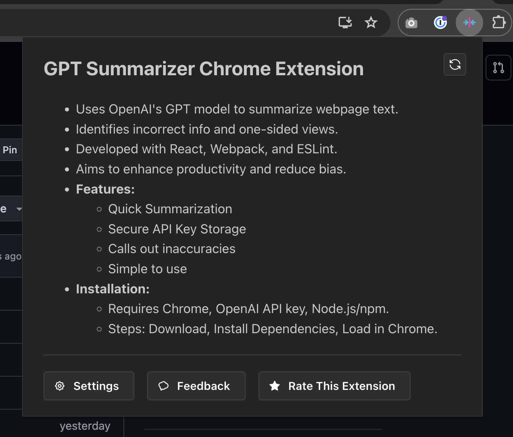

# GPT Summarizer Chrome Extension


_Demo of the extension summarizing this README_

GPT Summarizer is a Chrome extension that utilizes OpenAI's powerful GPT models to summarize text content from any webpage. Additionally, it highlights inaccurate information and one-sided perspectives. **You must provide your own OpenAI API key to use this extension.**

**The goal of this tool is to:**

- Enhance productivity providing quick insights into web articles, news, and other extensive written materials with the click of a button.
- Call out factually incorrect information and one-sided viewpoints in the summary.
- Bridge the gap between scanning headlines and reading a full article start to finish.
- Decrease dividing biases caused by social echo chambers.

## Features

- **Quick Summarization**: Summarizes text directly from web pages using OpenAI's GPT model.
- **Secure API Key Storage**: Uses Chrome's storage API to securely store and retrieve your OpenAI API key.
- **Calls out Factually Incorrect Information and One-Sided Viewpoints**: If the model detects any factually incorrect information, it will be highlighted in the summary.
- **Easy to Use**: Click button, get summary. It's that simple!

## Installation

[Install this extension in the Chrome Web Store](https://chromewebstore.google.com/detail/gpt-summarizer/ofcjacnckhgbmeompdemfppfmfogahgf)

## Development

### Prerequisites

- Google Chrome Browser
- OpenAI API Key (You can obtain one by creating an account on [OpenAI](https://openai.com/api/))
- Node.js and npm installed on your local machine

### Loading the Extension

1. **Download the Extension**:
   Clone this repository or download the ZIP to your local machine.

   ```bash
   git clone https://github.com/coryshaw/gpt-summarizer-extension.git
   ```

2. **Install Dependencies and Build the Project**:
   Navigate to the project directory and install the dependencies. Then, build the project which will generate the necessary files in the `dist` directory.

   ```bash
   cd gpt-summarizer-extension
   npm install
   npm run build
   ```

3. **Install the Extension**:
   - Open Google Chrome and navigate to `chrome://extensions/`.
   - Enable Developer Mode by toggling the switch in the top right corner.
   - Click on the `Load unpacked` button and select the `dist` directory inside the `gpt-summarizer-extension` directory.
